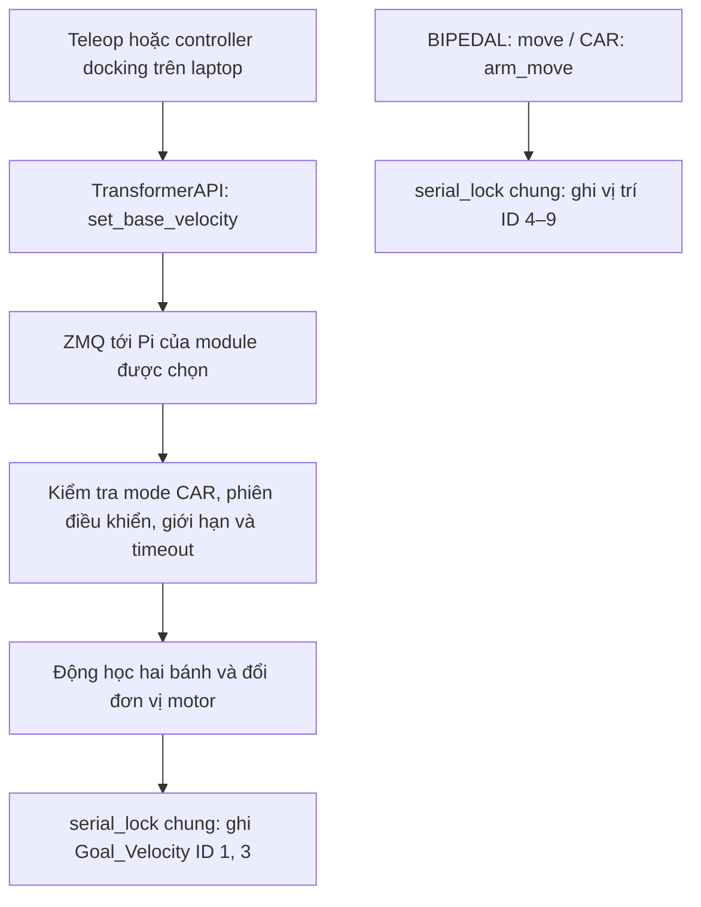
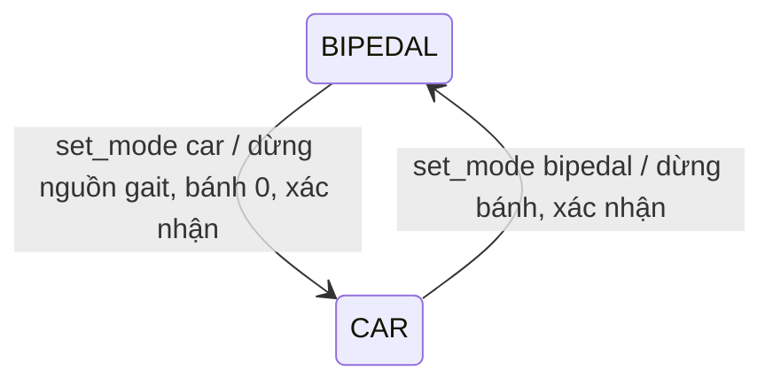

# Kế hoạch hai mode robot: BIPEDAL và CAR

**Ngày:** 25/09/2026.  
**Bản thiết kế:** 2 — chuyển mode robot bằng `set_mode("bipedal")` / `set_mode("car")`.  
**Trạng thái:** kế hoạch để duyệt trước khi sửa code; các API và file mới bên dưới chưa được triển khai.  
**Mục tiêu:** sau khi tách, mỗi module chạy độc lập bằng hai bánh; các khớp chân tiếp tục được điều khiển theo vị trí để làm tay gắp. Giữ tương thích luồng điều khiển bipedal hiện tại.

## 0. Cách dùng cần đạt được

Người sử dụng chọn **một trong hai mode của robot** bằng một hàm:

```python
robot.set_mode("bipedal")
robot.set_mode("car")
```

| Mode robot | Bánh ID 1, 3 trên mỗi module | Khớp ID 4–9 trên mỗi module | API người dùng gọi |
|---|---|---|---|
| `BIPEDAL` | Tốc độ bằng 0, khóa lệnh lái | Nhận position để điều khiển chân như hiện tại | `set_joint_angles(...)` |
| `CAR` | Nhận velocity để chạy xe vi sai | Vẫn nhận position khi dùng làm tay gắp | `set_base_velocity(...)`, tùy nhu cầu thêm `set_arm_positions(...)` |

**Position/velocity thuộc từng nhóm motor.** Chuyển sang `CAR` không đổi motor 4–9 sang velocity. Bánh có thể giữ operating mode velocity ở cả hai mode robot, với mục tiêu 0 khi ở `BIPEDAL`; khớp chân/tay luôn làm việc theo position. `set_mode()` thay đổi quyền nhận lệnh và vòng điều khiển đang được dùng, không ghi lại operating mode/PID toàn bus mỗi lần chuyển.

Ví dụ trình tự dự kiến, chưa phải code đang chạy được:

```python
robot.initialize()                      # Mặc định BIPEDAL, giữ luồng khởi tạo cũ
robot.set_joint_angles(...)             # Gửi vị trí chân như đang dùng

# Gait đã được đưa về trạng thái dừng ổn định;
# cơ cấu đã sẵn sàng ở dạng xe trước khi bật CAR.
if not robot.set_mode("car"):
    raise RuntimeError("Chưa chuyển được sang CAR")
robot.set_base_velocity(module="left", v=0.10, omega=0.0)
# Trong lúc lái: vòng teleop/docking lặp lại lệnh mới đều đặn.

# Sau khi cơ cấu sẵn sàng cho bipedal:
if not robot.set_mode("bipedal"):
    raise RuntimeError("Chưa chuyển được sang BIPEDAL")
robot.set_joint_angles(...)             # Tiếp tục điều khiển position
```

`set_mode("bipedal")` tự dừng bánh trước khi cho phép điều khiển chân. Không cần restart server hoặc tạo lại `TransformerAPI` trong luồng chuyển mode với cả hai module đã kết nối. Hàm trả thành công sau khi các Pi liên quan đã xác nhận; ứng dụng chỉ bắt đầu vòng điều khiển mới sau kết quả này.

`set_mode()` chuyển mode phần mềm. Quỹ đạo chuyển hình, tách/ghép cơ khí và đưa về tư thế đứng là các thao tác riêng. Lần chuyển mode không tự gọi home/initial pose và không tự chạy lại policy; ứng dụng chủ động bắt đầu controller tương ứng khi cơ cấu đã sẵn sàng.

## 1. Phạm vi và quy ước

Mỗi module có một Pi và một bus servo riêng. `module="left"` là xe tách từ chân trái, không phải bánh trái. Cả hai module đều có cặp bánh ID **1 và 3**; không thêm ID 2 vào cấu hình khi chưa có phần cứng tương ứng.

| Bộ phận trên mỗi module | Motor | Kiểu lệnh |
|---|---|---|
| Bánh phải | ID 1, `base_right_wheel` | Tốc độ, `Goal_Velocity` |
| Bánh trái | ID 3, `base_left_wheel` | Tốc độ, `Goal_Velocity` |
| Các khớp chân/tay và gripper | ID 4–9 | Vị trí, giữ giao thức `move` hiện tại |

Kế hoạch này triển khai đường điều khiển `v, omega` tới bánh, mode phần mềm, dừng bánh, phản hồi và kiểm thử. Việc tháo/ghép cơ khí, quỹ đạo chuyển chân thành tay, IK tay gắp và docking tự động là các bước riêng. Chọn mode phần mềm không chứng minh cơ cấu đã tách thật.

Quy ước chung: `v` tính bằng m/s, dương là tiến; `omega` tính bằng rad/s, dương là quay trái khi nhìn từ trên. Gốc thân xe đặt giữa trục hai bánh. Phần mềm chỉ nhận hai thành phần này, không nhận vận tốc trượt ngang.

## 2. Những gì đã xác minh trong code

| Vị trí | Hiện trạng | Hệ quả với mode xe |
|---|---|---|
| [bipedal.py](../../bipedal_nam/src/bipedal_robot/bipedal.py), [bipedal_left.py](../../bipedal_nam/src/bipedal_robot/bipedal_left.py) | Khai báo hai bánh nhưng `_body_to_wheel_raw()` và `_wheel_raw_to_body()` dùng ma trận ba bánh omni | Cần động học hai bánh và loại bỏ đầu ra `base_back_wheel` khỏi luồng mới |
| `BipedalRobot.configure()` | Đặt bánh sang velocity mode; `leg_motors` lọc tiền tố `leg` không khớp tên khớp thực tế | Vòng cấu hình position mode/PID cho khớp hiện bị bỏ qua; sửa lỗi này có thể đổi hành vi chân |
| Các leg server | `move` điều khiển danh sách sáu vị trí ID 4–9; nhánh PULL chỉ nhận `move` | Phải mở rộng cả xử lý lệnh và nhánh nhận PULL |
| `process_command("stop")` | Giữ vị trí motor 4–9 | Chưa phải lệnh dừng bánh |
| [TransformerAPI.initialize()](../../bipedal_nam/src/bipedal_robot/transformer.py) | Tự đưa hai chân về home rồi initial pose, khởi tạo IMU fusion của hai bên | Cần nhánh khởi tạo xe riêng để tránh di chuyển tay và hợp nhất IMU của hai xe độc lập |
| `TransformerAPI.set_joint_angles()` | Chỉ đặt hip/knee/foot; các vị trí còn lại lấy từ home | Không dùng hàm này làm API điều khiển đầy đủ tay gắp |
| `TransformerAPI.shutdown()` | Đóng socket, chưa gửi dừng bánh | Cần dừng các module đang được client điều khiển bánh trước khi đóng kết nối |

Tại thời điểm lập kế hoạch, tìm trong repo chỉ thấy định nghĩa hai hàm động học bánh cũ, chưa thấy nơi gọi chúng. Khi triển khai vẫn phải đối chiếu code thực tế trên Pi và các client ngoài repo trước khi thay chữ ký hàm.

## 3. Kiến trúc được đề xuất

**Laptop gửi `v, omega`; Pi tính tốc độ từng bánh, giới hạn lệnh và ghi motor.** Cấu hình hình học và chiều motor nằm tại Pi tương ứng.



Hai module dùng chung thuật toán nhưng cấu hình riêng. Chỉ server đang sở hữu bus servo được mở cổng serial; không chạy thêm một wheel server độc lập cùng mở `/dev/ttyACM0`.

`TransformerAPI.set_mode()` điều phối chuyển mode; mode tại server là căn cứ cuối cùng để chấp nhận lệnh. Client và server đều chặn gọi sai mode. Ứng dụng cần dừng nguồn phát lệnh mode cũ trước khi chuyển; đổi biến `robot.mode` đơn thuần không làm một vòng policy bên ngoài tự dừng.

## 4. Danh sách file cần sửa hoặc thêm

Các đường dẫn trong bảng tính từ gốc repo. `Dev_Vinh_Minh` là workspace chính; các đường dẫn `bipedal_nam` bên dưới là lớp/API được server hiện có import, cần đối chiếu đúng bản đang cài trên Pi.

| File | Thay đổi cụ thể |
|---|---|
| **Thêm** `bipedal_nam/src/bipedal_robot/diff_drive.py` | `DiffDriveConfig`, phép đổi `v, omega` ↔ tốc độ hai bánh, giới hạn tốc độ, đổi đơn vị theo cấu hình đã xác minh; phần toán không import driver motor |
| **Thêm** `bipedal_nam/src/bipedal_robot/mode_controller.py` | `RobotMode` gồm `BIPEDAL`/`CAR` và `ModeController` dùng chung cho server: chuyển mode, quyền nhận lệnh, phiên điều khiển, lệnh bánh mới nhất, giới hạn và timeout; dùng đối tượng robot/bus hiện có |
| **Thêm** `bipedal_nam/config/diff_drive_left.json`, `diff_drive_right.json` | Cấu hình riêng từng module; giá trị chưa đo để `null`, không cho bật lái khi còn thiếu |
| **Sửa** `bipedal_nam/src/bipedal_robot/bipedal.py` | Thêm hàm ghi/đọc tốc độ hai bánh và cấu hình bánh riêng; thay hoặc ngừng sử dụng động học ba bánh theo mục 6 |
| **Sửa** `bipedal_nam/src/bipedal_robot/bipedal_left.py` | Cùng thay đổi với bản phải; dùng lại toán chung, không chép thêm một bản công thức |
| **Sửa cặp server đang thực sự chạy** | Nạp cấu hình, thêm lệnh mode/drive/stop, gọi vòng cập nhật bánh, dùng khóa serial chung, phản hồi riêng và dừng sớm khi shutdown |
| **Sửa** `bipedal_nam/src/bipedal_robot/transformer.py` | `set_mode(mode)` điều phối các Pi, kiểm tra mode trước khi gửi lệnh, nhánh khởi tạo và quản lý IMU theo mode; giữ mặc định khởi tạo bipedal |
| **Thêm** `Dev_Vinh_Minh/WheelControl/test_drive_client.py` | Client thử một module, có chế độ chỉ in lệnh; thực thi hardware phải chọn module, tốc độ và thời gian rõ ràng |
| **Thêm** `Dev_Vinh_Minh/WheelControl/tests/` | Kiểm tra toán, bộ giám sát bằng clock/bus giả và tương thích giao thức |

**Chọn đúng server trước khi sửa:**

- Bản REQ/REP: `bipedal_nam/src/leg_server/leg_server_left.py` và `leg_server_right.py`.
- Bản có PUB/SUB IMU: `bipedal_nam/src/leg_server_pubsub/leg_Server_left.py` và `leg_Server_right.py`.
- `Dev_Vinh_Minh/Debug_Server/left.py`, `right.py`, `left_pi_now.py` là các bản kéo từ Pi về để debug theo ghi chú dự án. Không mặc định chúng là entrypoint triển khai.

Đối chiếu đường dẫn tiến trình/service và phiên bản đang chạy trên mỗi Pi, chọn một cặp để triển khai trước. Nếu cần hỗ trợ cả hai loại server thì gắn cùng `mode_controller.py` vào cả hai; không sửa nhầm bản debug rồi cho rằng Pi đã có tính năng mới.

## 5. Cấu hình và động học bánh

### 5.1. Thông số phải có trước khi chạy thật

| Tham số | Ý nghĩa và cách xác định |
|---|---|
| `wheel_radius_m` | Bán kính lăn thực tế; không mặc định lấy `0.05` từ code omni cũ |
| `wheel_separation_m` | Khoảng cách ngang giữa tâm vệt tiếp xúc hai bánh; không dùng nhầm `base_radius` của đế omni |
| `left_direction`, `right_direction` | `+1` hoặc `-1` sao cho tốc độ bánh dương làm xe tiến; thử riêng từng bánh trên từng module |
| `motor_to_wheel_ratio` | Tỉ số tốc độ trục đầu ra servo/tốc độ bánh; bằng 1 nếu bánh gắn trực tiếp, không nhân lại hộp số bên trong servo |
| `raw_per_motor_rad_s` | Hệ số đổi rad/s của trục đầu ra servo sang đơn vị thanh ghi tốc độ, xác minh theo driver/firmware thực tế |
| `max_raw_left`, `max_raw_right` | Giới hạn lệnh theo motor thực tế và mức chạy thử đã chọn |
| `max_v_m_s`, `max_omega_rad_s` | Giới hạn vận tốc thân xe |
| `max_wheel_accel_rad_s2` | Giới hạn thay đổi tốc độ bánh cho lệnh lái thông thường |
| `command_timeout_s` | Thời gian mất lệnh lái trước khi gửi dừng |

Mốc triển khai ban đầu có thể dùng vòng bánh **50 Hz**, client **20–50 Hz**, timeout **0.25 s**; đây là giá trị đề xuất cần đo lại theo độ trễ thực tế. Không coi chúng là thông số đã thử trên robot.

Thư mục `lerobot/` trong checkout hiện tại không chứa source driver. Trước khi chốt đổi đơn vị phải đọc đúng phiên bản `FeetechMotorsBus` đang dùng trên Pi: đơn vị `Goal_Velocity`/`Present_Velocity`, miền giá trị, cách biểu diễn dấu và xử lý của `normalize=False`. Không tự OR bit dấu từ code LeKiwi cũ nếu driver đã thực hiện mã hóa.

### 5.2. Phép đổi cần viết

Với `b = wheel_separation_m`, `r = wheel_radius_m`:

```text
wheel_left_rad_s  = (v - omega*b/2) / r
wheel_right_rad_s = (v + omega*b/2) / r

raw_left  = round(left_direction  * motor_to_wheel_ratio * raw_per_motor_rad_s * wheel_left_rad_s)
raw_right = round(right_direction * motor_to_wheel_ratio * raw_per_motor_rad_s * wheel_right_rad_s)
```

Khi một bánh vượt giới hạn, giảm cả hai bằng cùng hệ số để giữ tỉ lệ tốc độ bánh. Áp dụng giới hạn gia tốc theo `dt` đo bằng monotonic clock và ghi rõ vận tốc thực thi sau giới hạn. Lệnh stop/timeout ghi 0 trực tiếp, không chờ ramp thông thường.

Phản hồi được giải mã theo driver, bỏ dấu lắp và tỉ số truyền để thu được tốc độ bánh vật lý, sau đó:

```text
v_measured     = r * (wheel_right_rad_s + wheel_left_rad_s) / 2
omega_measured = r * (wheel_right_rad_s - wheel_left_rad_s) / b
```

Đây là phép suy ra vận tốc từ bánh, chưa phải ước lượng pose có bù trượt. Bộ điều khiển đầu tiên đặt tốc độ theo động học và đọc phản hồi để kiểm chứng; chưa thêm PID bên ngoài khi chưa đo đặc tính đáp ứng motor.

## 6. Sửa hai lớp `BipedalRobot` như thế nào

1. Giữ nguyên tên/ID motor và các hàm ghi vị trí motor 4–9. Thêm cấu hình bánh riêng, chỉ bắt buộc khi bật tính năng lái.
2. Thay phần động học ba bánh bằng lời gọi tới module toán chung. Đặt tên rõ đơn vị, ví dụ `body_to_wheel_raw(v_m_s, omega_rad_s)` và `wheel_raw_to_body(left_raw, right_raw)`. Bỏ đối số bánh sau và `y` khỏi giao diện mới. Nếu còn client ngoài repo gọi hàm cũ thì phải chuyển đổi client hoặc báo lỗi rõ; không âm thầm hiểu `theta` deg/s thành rad/s.
3. Thêm `write_base_velocity_raw(left_raw, right_raw)`: một lần `sync_write("Goal_Velocity", {"base_left_wheel": ..., "base_right_wheel": ...}, normalize=False)`, sau khi đã xác minh driver. Không ghi `Goal_Position` cho bánh.
4. Thêm `read_base_velocity_raw()` đọc riêng `Present_Velocity` của ID 1, 3; lỗi đọc trả trạng thái thiếu dữ liệu thay vì giả giá trị 0.
5. `stop_base()` ghi 0 cho đúng hai bánh. Không gọi `disable_torque()` toàn bus để thực hiện lệnh dừng bánh.
6. Thêm `configure_base()` chỉ tác động ID 1, 3: cấu hình velocity mode, ghi mục tiêu 0 trước khi bật torque bánh. Nếu cần tắt torque để cấu hình thì chỉ tắt nhóm bánh. Không gọi lại `configure()` toàn robot khi chuyển mode giữa lúc đang hoạt động.
7. Trong khởi tạo hiện có, bảo đảm lệnh tốc độ bánh bằng 0 trước bước bật torque bánh. Giới hạn thay đổi ở phần bánh, không tự ghi lại tham số motor 4–9.

**Xử lý riêng lỗi `leg_motors`:** chưa sửa bộ lọc đó trong thay đổi controller bánh. Việc sửa sẽ kích hoạt các lệnh ghi position mode và P/I/D đang bị bỏ qua, có thể đổi đáp ứng chân. Trước khi cho tay hoạt động ở mode xe, đọc kiểm tra các khớp 4–9 đang ở position mode. Nếu không đúng thì báo lỗi và xử lý cấu hình khớp bằng một thay đổi riêng đã được kiểm chứng; không coi lỗi hiện tại là bằng chứng các khớp đã cấu hình đúng.

## 7. Chuyển BIPEDAL ↔ CAR tại server

### 7.1. Hai mode người dùng chọn



Mỗi server lưu `mode = BIPEDAL | CAR`. `SWITCHING` và `ERROR` là trạng thái xử lý nội bộ, không phải mode sử dụng thứ ba. Khi đang chuyển hoặc gặp lỗi, chặn lệnh chuyển động mới và báo trạng thái để API không tiếp tục như thể đã chuyển thành công.

| Lệnh tới server | Ở BIPEDAL | Ở CAR |
|---|---|---|
| `move`, `home` phục vụ chân | Nhận như hiện tại, kiểm tra phiên nếu có | Từ chối để client gait cũ không điều khiển nhầm tay |
| `drive` | Từ chối; bánh giữ mục tiêu 0 | Nhận khi phiên lái hợp lệ |
| `arm_move` | Từ chối | Gọi lại `apply_new_positions()` cho sáu khớp ID 4–9 |
| `stop` hiện có | Giữ vị trí khớp như hiện tại | Giữ vị trí tay theo cùng logic; không thay thế dừng bánh |
| `stop_drive` | Gửi 0 cho bánh | Gửi 0 cho bánh và thu hồi phiên lái |
| Truy vấn feedback | Được phép | Được phép |

`arm_move` chỉ là tên lệnh phân biệt nguồn điều khiển trên mạng; bên dưới vẫn dùng cùng hàm ghi position và cùng giới hạn khớp. Người dùng gọi `set_arm_positions()` và không phải tự tạo JSON.

### 7.2. Trình tự chuyển mode

**BIPEDAL → CAR:**

1. Ứng dụng đưa gait về trạng thái dừng ổn định và ngừng phát lệnh gait trước khi gọi `set_mode("car")`.
2. API chặn phát lệnh chuyển động mới trong thời gian chuyển; server vào trạng thái `SWITCHING`, thu hồi phiên cũ và loại mục tiêu đang chờ của phiên đó.
3. Server gửi tốc độ 0 cho bánh, kiểm tra cấu hình vi sai và operating mode thực của các nhóm motor. Giữ mục tiêu vị trí khớp; không tự homing hoặc sửa PID.
4. Server cập nhật `mode=CAR`, cấp phiên mới và trả ACK. Bánh vẫn có mục tiêu 0 tới khi nhận lệnh `drive` mới.
5. Khi mọi module được chọn đã xác nhận, API cập nhật `robot.mode="car"`, điều chỉnh đường IMU và trả thành công. Lúc này ứng dụng có thể bắt đầu teleop/docking.

**CAR → BIPEDAL:**

1. Ứng dụng ngừng nguồn phát lệnh lái/tay của mode cũ; gọi `set_mode("bipedal")` khi cơ cấu sẵn sàng cho chế độ chân.
2. API và server chặn lệnh mới trong lúc chuyển, thu hồi phiên cũ; server gửi tốc độ 0 cho cả hai bánh và xóa mục tiêu lái còn chờ.
3. Đọc phản hồi bánh để xác nhận tốc độ về gần 0 trong dung sai và thời gian chờ được cấu hình. Gửi 0 thành công chưa đủ để kết luận bánh đã dừng. Thiếu phản hồi hoặc vượt thời gian chờ phải báo lỗi chuyển mode.
4. Server cập nhật `mode=BIPEDAL` và trả ACK. Các khớp giữ mục tiêu position hiện tại; không tự nhảy về tư thế chân.
5. API chỉ cho phép `set_joint_angles()` khi các server cần cho bipedal đã xác nhận và đường IMU tương ứng đã sẵn sàng. Ứng dụng chủ động chạy bước chuẩn bị tư thế/policy sau đó.

**Một API quản lý hai Pi:** mặc định `set_mode()` áp dụng cho cả module trái và phải. Trong `CAR`, từng xe nhận tốc độ độc lập qua tham số `module`. Mode bipedal đầy đủ yêu cầu cả hai module được kết nối; instance chỉ kết nối một module để thử xe sẽ từ chối chuyển sang bipedal cho tới khi có đủ kết nối.

Hai Pi có thể trả lời ở thời điểm khác nhau. API chỉ báo thành công chung khi nhận đủ ACK; không phát lệnh chuyển động trong khoảng chuyển. Nếu một bên thất bại/mất kết nối, gửi dừng tới các bên còn liên lạc được, báo kết quả từng bên và giữ trạng thái chung `ERROR`/chưa xác định thay vì giả định hai Pi cùng mode. Pi còn chạy sẽ tự timeout bánh nếu mất client. Lần chuyển tiếp theo phải đọc lại trạng thái thực; không tự homing để cố hoàn tất.

### 7.3. Giao thức nội bộ

| Lệnh | Kênh | Dữ liệu chính |
|---|---|---|
| `set_mode` | REQ/REP | `mode: BIPEDAL | CAR`; ACK gồm mode đã áp dụng và phiên mới |
| `drive` | PUSH/PULL | `v`, `omega`, `drive_session`, `seq` |
| `arm_move` | PUSH/PULL | Sáu `positions` theo thứ tự ID 4–9 và `mode_session` |
| `stop_drive` | REQ/REP | Gửi 0 và thu hồi phiên lái; nhận được ở mọi mode |
| `base_feedback` | REQ/REP | Mode, trạng thái chuyển/lỗi, trạng thái bật lái, tuổi lệnh và vận tốc bánh |

Ví dụ payload, do API tự tạo:

```json
{"type": "set_mode", "mode": "CAR"}
{"type": "drive", "v": 0.10, "omega": 0.0, "drive_session": "server-issued-session", "seq": 1}
{"type": "set_mode", "mode": "BIPEDAL"}
```

`mode_session` đổi khi chuyển mode; `drive_session` còn bị thu hồi khi dừng/timeout. API quản lý các giá trị này bên trong, người dùng chỉ gọi các hàm mode/position/velocity. `seq` tăng trong phiên giúp bỏ lệnh lặp/ngược thứ tự. Lệnh arm/drive của phiên CAR cũ phải bị bỏ cả khi xe đã rời rồi quay lại CAR.

Để giữ client cũ chạy bipedal, server mới vẫn nhận payload `move` cũ khi khởi động BIPEDAL theo luồng tương thích. Sau khi tham gia chuyển mode có quản lý, các lệnh chuyển động phải mang phiên hiện tại; API mới tự gắn phiên vào lệnh position mà không đổi chữ ký `set_joint_angles()`. Client cũ không có phiên không được tiếp tục lái một server đã chuyển mode. Kiểm tra cả các lệnh di chuyển gián tiếp như `home` để không có đường bỏ qua quy tắc này.

Các cổng hiện tại giữ nguyên: module phải REQ/REP **5555**, PULL **5655**; module trái **5556**, **5656**. Không phải đổi cổng khi chuyển mode.

### 7.4. Các điểm server phải sửa

- `__init__()`: tạo `ModeController`, mặc định BIPEDAL với bánh 0. Thiếu cấu hình bánh vẫn cho bipedal cũ hoạt động nhưng từ chối chuyển CAR.
- `process_command()`: thêm `set_mode`, `stop_drive`, `base_feedback`; kiểm tra quyền theo mode cho các lệnh di chuyển hiện có.
- Nhánh PULL trong `run()`: phân loại `move`, `drive`, `arm_move`; kiểm tra mode/phiên trước khi gọi hàm ghi motor. Chặn sai kiểu, NaN/Inf, sai phiên, sequence cũ.
- Chạy tick bánh theo nhịp dự kiến, chỉ xuất tốc độ khác 0 khi ở CAR và phiên lái còn hạn. Tính timeout bằng `time.monotonic()`; không so trực tiếp monotonic clock laptop với Pi.
- `move`, `arm_move`, feedback và IMU không gia hạn timeout bánh. Timeout ghi 0, thu hồi phiên lái nhưng vẫn giữ mode CAR; người dùng gọi lại `set_mode("car")` để tái xác nhận và lấy phiên lái mới.
- Chỉ giữ mục tiêu bánh hợp lệ mới nhất, giới hạn xử lý hàng đợi mỗi vòng. Không bật `ZMQ_CONFLATE` trên socket dùng chung vì sẽ làm mất lệnh khớp; việc bỏ lệnh bánh cũ thực hiện theo loại lệnh trong ứng dụng.
- Mọi thao tác bánh/tay dùng chung `self.serial_lock`. Một tầng lấy khóa quanh bus, không khóa lồng và không giữ khóa trong khi chờ mạng/sleep.
- `shutdown()`: chặn phát lệnh và cố gắng dừng bánh trước khi join thread/đóng socket; dừng lặp lại phải hợp lệ, lỗi ghi phải được báo.

Vòng server hiện có thể bị chặn bởi serial/retry. Phải giới hạn và đo thời gian này khi kiểm tra timeout; watchdog phần mềm xử lý mất mạng/client khi server còn chạy, không bảo đảm dừng nếu cả tiến trình Pi bị treo hoặc mất nguồn.

`base_feedback` là schema riêng, không kéo dài mảng servo sáu phần tử hay sửa gói binary/IMU cũ. Phân biệt vận tốc yêu cầu, vận tốc đã giới hạn và vận tốc đo; dữ liệu đọc lỗi có cờ validity/tuổi mẫu, không giả thành tốc độ 0.

## 8. Sửa `TransformerAPI` để chuyển mode bằng một hàm

### 8.1. Khởi tạo và chuyển mode có vai trò khác nhau

Chữ ký dự kiến:

```python
initialize(warmup_time=5.0, *, mode="bipedal", modules=("left", "right"))
set_mode(mode)  # "bipedal" hoặc "car"; áp dụng cho các module đã kết nối
```

- `initialize()` không đối số mới giữ hành vi bipedal cũ: home/initial pose và IMU fusion. Nếu server mới đang CAR thì cần chuyển về BIPEDAL có xác nhận trước khi thực hiện luồng homing này.
- `initialize(mode="car")` chuẩn bị kết nối và đi qua cùng quy trình `set_mode("car")`, không homing, không đưa về initial pose. Khi thành công robot ở CAR nhưng tốc độ bánh vẫn bằng 0.
- `initialize(mode="car", modules=("left",))` hỗ trợ thử riêng xe trái khi xe phải offline. Chuyển sang bipedal đầy đủ cần kết nối thêm module còn lại.
- `set_mode()` trên kết nối đang hoạt động không gọi lại `initialize()`, không home/initial pose và không mở lại bus motor. Đây là đường chuyển qua lại trong lúc sử dụng.
- Server cũ có thể tiếp tục phục vụ luồng bipedal cũ; yêu cầu chuyển mode mới phải báo chưa hỗ trợ nếu chưa cập nhật server, không tự nhận là đã chuyển.

### 8.2. Các hàm người dùng cần biết

| Hàm | Dùng khi nào | Tác dụng |
|---|---|---|
| `set_mode("car")` | Cơ cấu đã sẵn sàng dạng xe | Dừng lệnh cũ, chuyển các Pi sang CAR, nhận phiên điều khiển mới |
| `set_mode("bipedal")` | Cơ cấu sẵn sàng dạng chân | Tự dừng bánh, chờ xác nhận rồi cho phép điều khiển chân |
| `set_joint_angles(...)` | BIPEDAL | Gửi position như đang dùng; sai mode thì báo lỗi trước khi gửi |
| `set_base_velocity(module, v, omega)` | CAR | Gửi một mẫu tốc độ thân xe tới module được chọn |
| `set_arm_positions(module, positions_raw)` | CAR | Gửi đầy đủ sáu vị trí ID 4–9 qua `arm_move` |
| `stop_base(module)` | Mọi mode | Dừng bánh và thu hồi phiên lái module đó; không thay đổi mục tiêu tay |
| `get_base_state(module)` | Mọi mode | Xem mode/trạng thái thực và phản hồi bánh |

`robot.mode` phản ánh mode chung đã xác nhận, chỉ cập nhật sau đủ ACK. Khi chuyển/lỗi thì không dùng giá trị mode cũ để cho phép gửi lệnh; API phải xét cả trạng thái sẵn sàng của các module.

Gọi `set_mode("car")` khi đã ở CAR sẽ đưa tốc độ về 0 và cấp lại phiên, phù hợp khi cần chạy lại sau timeout/`stop_base()`. Không gọi hàm này ở mỗi vòng lái; chỉ gọi khi chuyển mode hoặc chủ động tái bật điều khiển.

Tốc độ là m/s và rad/s. `set_base_velocity()` gửi một mẫu; vòng teleop/docking lặp lại lệnh mới 20–50 Hz theo cấu hình. Không tự phát lặp vô hạn lệnh khác 0 sau khi controller cấp cao đã ngừng cập nhật. PUSH gửi được chưa chứng minh motor thực thi; dùng feedback để kiểm chứng.

`set_arm_positions()` dùng thứ tự `[bub, hip, twist, knee, foot, gripper]` và giữ joint limits tại server. Không dùng `set_joint_angles()` làm tay gắp vì hàm cũ đặt các khớp khác từ home.

### 8.3. IMU và đời sống kết nối

Khi chuyển CAR, dừng/join vòng IMU fusion của hai chân và đánh dấu dữ liệu hợp nhất cũ không còn hợp lệ. Nếu cần IMU khi lái, lấy riêng từng xe. Khi quay lại BIPEDAL, tạo lại/reset fusion và chờ mẫu mới hợp lệ trước khi công bố sẵn sàng cho policy; không dùng cache từ thời điểm trước khi tách. Không chạy trùng hai thread fusion khi chuyển nhiều lần.

REQ/REP mới cần timeout có hạn và khôi phục socket sau timeout trước giao dịch tiếp theo. Quy định một luồng sở hữu mỗi socket hoặc dùng kênh riêng theo luồng; không chia cùng socket cho các thread phát lệnh cạnh tranh. `set_mode()` phải đồng bộ với việc gửi lệnh để không phát lệnh mode cũ giữa một lần chuyển.

Trong `shutdown()`, cố gắng dừng các module do client này đã bật lái rồi đóng socket. Pi vẫn tự timeout nếu lệnh dừng không tới. Client chỉ dùng bipedal không phải tự thêm lệnh stop bánh vào code ứng dụng.

## 9. Các giới hạn tương thích cần giữ khi review

| Hạng mục | Yêu cầu |
|---|---|
| Luồng đi bộ cũ | Chữ ký mặc định, mảng sáu vị trí, home/initial pose và phép đổi góc không đổi ở BIPEDAL. API tự thêm phiên sau khi chuyển mode; client cũ chỉ được giữ luồng tương thích trước khi server tham gia chuyển mode |
| Cấu hình khớp | Không gộp sửa `leg_motors`, PID, torque, calibration hay joint limits vào thay đổi bánh |
| Dừng tay/chân | `stop` cũ giữ ý nghĩa hiện có; dừng bánh dùng `stop_drive` riêng |
| Feedback cũ | Sáu phần tử servo và giao thức IMU hiện tại không đổi; thêm `base_feedback` riêng |
| Driver trên laptop | Giữ import lười; import `TransformerAPI`/toán xe không bắt buộc cài driver Feetech |
| Bánh khi chưa bật lái | Không có lệnh khác 0 do khởi tạo, điều khiển chân hoặc gói lái sai mode |

Hai nhóm motor vẫn dùng chung bus, vì vậy tương thích giao thức không đồng nghĩa không có ảnh hưởng thời gian chạy. Cần đo chu kỳ điều khiển chân và độ trễ serial trước/sau, đặc biệt khi bánh và tay hoạt động đồng thời.

## 10. Thứ tự triển khai và tiêu chí nghiệm thu

1. **Chốt phần cứng và bản server:** xác nhận ID 1/3, hình học hai bánh, dấu quay, đơn vị driver, cấu hình motor 4–9 và entrypoint thực trên từng Pi. Ghi các thông số còn thiếu vào hai file config; chưa bật lái khi thiếu.
2. **Viết toán và cấu hình:** thử tiến/lùi, quay tại chỗ, đường cong, đổi xuôi/ngược và bão hòa. Ví dụ chỉ dùng trong test: `r=0.05 m`, `b=0.20 m`, `v=0.10 m/s`, `omega=0` phải ra `(2, 2) rad/s`; `v=0`, `omega=1 rad/s` phải ra `(-2, 2) rad/s` trước dấu lắp motor.
3. **Thêm hàm bus và quản lý mode:** dùng bus giả kiểm tra drive/stop chỉ ghi ID 1, 3; không ghi lại P/I/D hoặc operating mode của ID 4–9. Kiểm tra CAR từ chối gait, BIPEDAL từ chối drive, hai mode dùng đúng nhóm motor. Dùng clock giả kiểm tra timeout và session.
4. **Ghép server và API:** kiểm tra `move` cũ vẫn tạo cùng lệnh cho sáu khớp ở BIPEDAL; nhánh init CAR không homing/fusion chung; `set_mode()` giữa hai mode không tự gửi position. Kết nối được một module để thử CAR khi module kia offline.
5. **Thử một module:** xác nhận dấu từng bánh ở tốc độ nhỏ, rồi tiến/lùi/quay tại chỗ. Đo tốc độ thực để xác nhận đơn vị và hệ số chuyển đổi; không kết luận chỉ từ bánh có quay.
6. **Thử điều kiện dừng:** dừng client, mất kết nối, sai session, lệnh quá cũ, stop khi còn gói trong hàng đợi, chuyển mode và restart server. Bánh không tự chạy lại từ phiên cũ; chỉ chạy sau khi bật lái phiên mới.
7. **Thử tay và bánh đồng thời:** lệnh tay không thay tốc độ bánh; drive/stop không đổi mục tiêu tay. Đo vòng lặp, độ trễ dừng và contention serial; nếu không đạt thì xử lý lịch bus trước khi tăng tần suất đọc/ghi.
8. **Thử chuyển mode và hồi quy bipedal:** kiểm tra hai bộ dấu/config, chuyển BIPEDAL → CAR → BIPEDAL nhiều lần trên cùng kết nối; không homing ngầm, không lặp thread IMU, không chấp nhận lệnh phiên cũ. Thử một Pi không ACK: API không báo thành công chung và các bên còn kết nối được yêu cầu dừng. Chạy lại luồng chân cũ với mode mặc định, kiểm tra mục tiêu bánh luôn 0 và độ trễ khớp trong mức đã đo/chấp nhận.

Các kiểm tra bắt buộc khác: reject NaN/Inf và cấu hình không hợp lệ; phản hồi lỗi khi ghi motor thất bại; feedback thiếu không biến thành số đo 0; `stop_base()` hoạt động lặp lại; nguồn `move`/feedback không giữ bánh chạy qua timeout; shutdown cố gắng dừng trước các thao tác chờ dài.

## 11. Triển khai lên Pi và nối với docking

Triển khai theo từng lớp đã qua kiểm tra, trước trên một module. Sao lưu/ghi nhận phiên bản đang chạy và tham số motor để có thể quay lại. Chỉ áp dụng bản mới vào service/entrypoint đã xác định ở mục 4.

Script [sync_pi.sh](../../sync_pi.sh) hiện chỉ nhắm `mobile2.local` và nhánh push dùng `rsync --existing`, nên **file Python/config mới sẽ không được tạo trên Pi bằng luồng đó**. Khi triển khai phải thêm bước chép rõ các file mới, kiểm tra đường import/config và triển khai riêng lên module phải; không coi một lần chạy script hiện tại là đã cập nhật đủ hai xe.

Sau khi điều khiển bánh đạt nghiệm thu, nối đầu ra `v, omega` từ [dock_math.py](../Docking_bipedal/sim2d/dock_math.py) vào `set_base_velocity()`. [control_tag.py](../Docking_bipedal/control_tag.py) vẫn chứa logic ba bánh omni, không dùng nguyên phần xuất bánh đó cho xe vi sai.

Lệnh tốc độ 0 chỉ yêu cầu bánh ngừng quay; chưa chứng minh xe được giữ cứng trước lực đẩy. Yêu cầu xe B `HOLD` khi docking trong [DOCKING_ASTOLFI.md](DOCKING_ASTOLFI.md) cần được kiểm chứng/thiết kế riêng theo khả năng giữ của motor hoặc cơ cấu khóa, trước khi chạy pha tiếp xúc.

## 12. Checklist hoàn thành phần controller bánh

- [ ] Chọn đúng server đang chạy và có đủ cấu hình hai module.
- [ ] Hai lớp robot dùng chung toán vi sai; lệnh bánh chỉ nhắm ID 1, 3.
- [ ] `set_mode("car")` / `set_mode("bipedal")` chuyển qua lại trên cùng kết nối, có ACK của các Pi.
- [ ] Server chặn lệnh sai mode; hỗ trợ drive/arm_move/stop/feedback, kiểm soát phiên và timeout.
- [ ] Khi chuyển CAR → BIPEDAL, đã gửi dừng và kiểm chứng bánh về gần 0 trước khi cho phép gait.
- [ ] Khởi tạo CAR và chuyển mode không tự đưa tay về home/initial pose; IMU được chuyển theo mode.
- [ ] Chuyển mode lỗi một bên không được công bố thành công chung; phản hồi chỉ rõ trạng thái từng module.
- [ ] API điều khiển độc lập từng module, kể cả chỉ một module online.
- [ ] Kiểm chứng tiến/lùi/quay, dừng/mất kết nối và tay hoạt động cùng bánh.
- [ ] Luồng bipedal cũ qua kiểm tra hồi quy; chưa gộp sửa lỗi `leg_motors`/PID.
- [ ] Các file mới được triển khai đủ lên đúng Pi, không bị bỏ qua bởi `--existing`.

